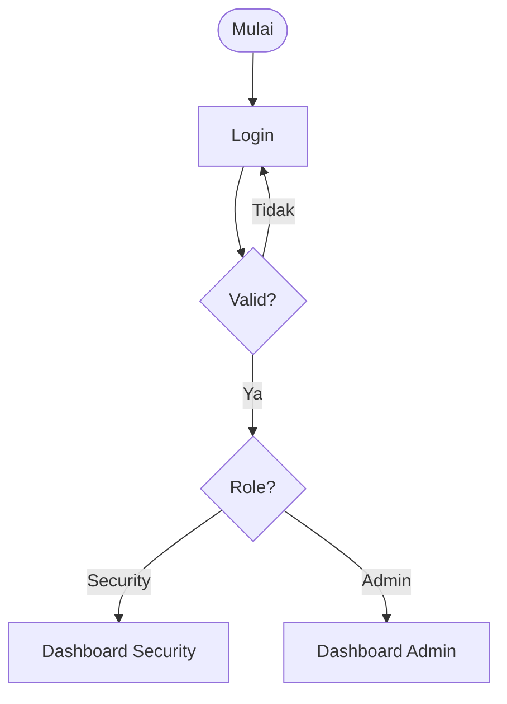
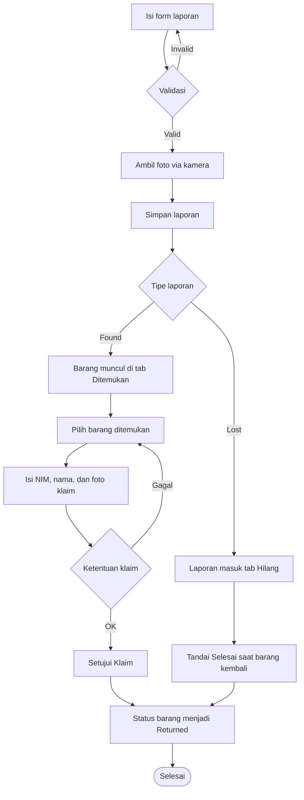
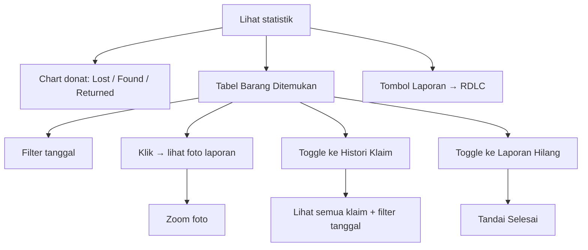
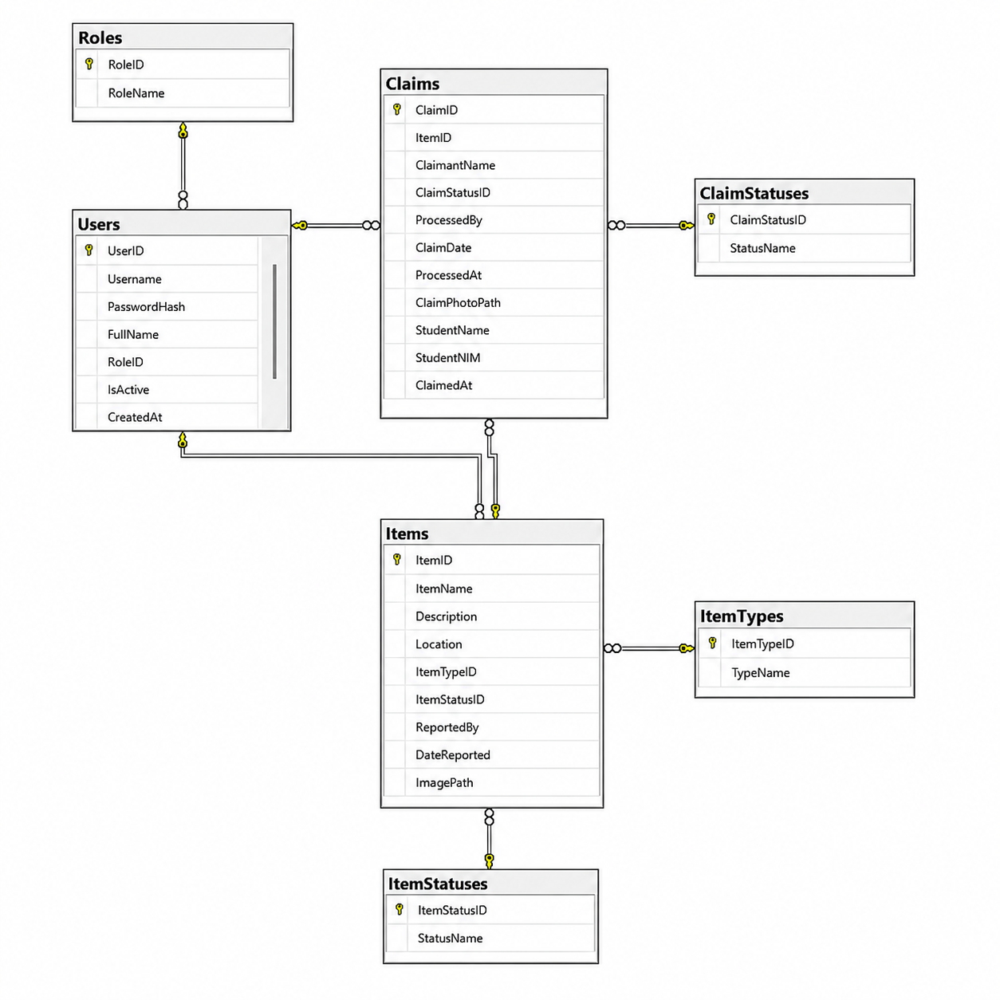

# Lost & Found — Asset Recovery Desk

Aplikasi desktop C# WinForms untuk mengelola laporan barang hilang dan barang temuan di lingkungan kampus. Aplikasi ini memiliki dua role: **Security** yang membuat laporan dan menyetujui klaim, serta **Admin** yang memonitor inventaris dan riwayat klaim secara menyeluruh.

---
### 👥 Anggota Kelompok 02

| Name | Student ID |
|------|------------|
| Kayleen Arli Lukito | 00000139701 |
| Aldrian Briandy Chea | 00000107416 |
| Jayson Christopher Lim | 00000136197 |
| Christian Zoe Beru Tena | 00000108336 |

---

## Daftar Isi

- [Alur Pengguna](#alur-pengguna)
- [Fitur](#fitur)
- [Teknologi](#teknologi)
- [Database](#database)
- [Penyimpanan Foto](#penyimpanan-foto)
- [Cara Menjalankan](#cara-menjalankan)
- [Struktur Project](#struktur-project)

## Alur Pengguna

### 1. Login

Pengguna memasukkan username dan password. Sistem mencocokkan kredensial ke tabel `Users`, membaca role (`Admin` / `Security`), lalu mengarahkan ke dashboard sesuai role. Session disimpan secara statis di `UserSession` dan dipakai di seluruh aplikasi.



### 2. Dashboard Security

Security bertanggung jawab mencatat barang, memproses klaim barang ditemukan, dan menyelesaikan watchlist barang hilang:



**Rincian panel Security:**

| Panel | Fungsi |
|-------|--------|
| **Laporan Baru** (kiri) | Form input: nama barang, lokasi, deskripsi, tipe (Lost/Found). Validasi memastikan semua field terisi. |
| **Kamera** (kanan atas) | Preview webcam langsung via AForge. Tombol: Mulai, Stop, Ambil, Ulangi. Foto tersimpan sebagai `Bitmap` di memori sampai laporan disimpan. |
| **Item Aktif** (bawah) | Grid dengan tab `Ditemukan` dan `Hilang`. Tab `Ditemukan` menampilkan barang found yang belum dikembalikan; tab `Hilang` menjadi watchlist laporan kehilangan aktif. |
| **Toolbar Klaim / Selesai** (atas grid) | Mode `Ditemukan` menampilkan input NIM, nama, foto verifikasi, dan tombol `Setujui Klaim`. Mode `Hilang` menyembunyikan input klaim dan menampilkan tombol `Tandai Selesai`. |

### 3. Dashboard Admin

Admin memonitor seluruh data, melihat klaim, dan bisa menyelesaikan laporan hilang:



**Rincian panel Admin:**

| Panel | Fungsi |
|-------|--------|
| **Statistik Header** | Tiga metrik mini: Aktif, Hilang, Kembali |
| **Barang Ditemukan** (kiri) | Grid dengan toggle `Barang` / `Hilang` / `Histori`, filter rentang tanggal, dan tombol Reset. Kolom status dirender sebagai badge berwarna; mode `Hilang` menyediakan tombol `Tandai Selesai`. |
| **Chart** (kanan) | Donat chart Guna: distribusi Hilang (merah), Ditemukan (biru), Dikembalikan (hijau). Tiga metrik pil di bawah chart. |
| **Panel Detail** (bawah) | Preview foto item/klaim. Klik gambar membuka `ImageZoomForm` dengan zoom scroll dan keyboard shortcut. |

### 4. Laporan (ReportForm)

Admin dapat membuka form laporan RDLC yang menampilkan seluruh item dalam layout cetak (print layout, page-width zoom).

---

## Fitur

- Login berbasis role `Admin` dan `Security`.
- Security menambah laporan barang (Lost/Found) dengan foto dari webcam.
- Laporan `Lost` masuk watchlist `Hilang` dan tidak memakai alur klaim.
- Security menyetujui klaim — memasukkan NIM, nama mahasiswa, dan foto verifikasi.
- Status barang otomatis berubah menjadi `Returned` setelah klaim disetujui.
- Security/Admin dapat menandai laporan `Hilang` sebagai selesai saat barang sudah ditemukan atau dikembalikan.
- Klaim lain yang masih `Pending` di item yang sama otomatis ditolak saat satu klaim disetujui.
- Validasi bertahap pada form klaim — hint kontekstual memberi tahu apa yang kurang.
- Admin melihat statistik real-time (chart donat + metrik).
- Admin melihat daftar barang ditemukan, laporan hilang, dan histori klaim dengan filter tanggal.
- Admin membuka laporan RDLC dalam layout cetak.
- Zoom foto interaktif (scroll wheel, keyboard shortcut, fit-to-screen, 1:1).

---

## Teknologi

| Komponen | Teknologi |
|----------|-----------|
| Framework | .NET Framework 4.7.2 |
| UI | WinForms + Guna UI2 (custom controls) |
| Chart | Guna Charts (WinForms) |
| Kamera | AForge.Video + AForge.Video.DirectShow |
| Report | Microsoft ReportViewer (RDLC) |
| Database | SQL Server / SQL Server Express (ADO.NET) |
| Spasial | Microsoft.SqlServer.Types |
| Font | Segoe UI Variable Text (system font, fallback Segoe UI) |

---

## Database

Database: `LostAndFoundDB`

### Diagram Relasi

<p align="center">
  
</p>

### Tabel

| Tabel | Deskripsi |
|-------|-----------|
| `Roles` | `Admin`, `Security` |
| `Users` | Username, PasswordHash, FullName, RoleID, IsActive |
| `Items` | ItemName, Description, Location, ItemTypeID, ItemStatusID, ReportedBy, DateReported, ImagePath |
| `ItemTypes` | `Lost`, `Found` |
| `ItemStatuses` | `Pending`, `Returned` |
| `Claims` | ItemID, ClaimantName, StudentNIM, StudentName, ClaimPhotoPath, ClaimStatusID, ProcessedBy, timestamps |
| `ClaimStatuses` | `Pending`, `Approved`, `Rejected` |

### Connection String

Connection string dikelola secara terpusat oleh class `DatabaseConnection` (`Data/DatabaseConnection.cs`). Class ini membaca satu-satunya sumber kebenaran dari `App.config`:

```xml
<add name="DbConn"
     connectionString="Data Source=localhost\SQLEXPRESS;Initial Catalog=LostAndFoundDB;Integrated Security=True;TrustServerCertificate=True"
     providerName="System.Data.SqlClient" />
```

Semua class yang butuh koneksi database — `DatabaseEntity` (dan turunannya `Item`, `Claim`) serta `LoginForm` — memanggil `DatabaseConnection.ConnectionString` atau `DatabaseConnection.CreateConnection()`. Tidak ada connection string yang di-hardcode di class manapun.

---

## Penyimpanan Foto

Path foto di database disimpan relatif:

```text
Images\20260524_120000_000_abcd1234.jpg
ClaimPhotos\claim_20260524_120000_000_abcd1234.jpg
```

Folder utama diatur lewat `PhotoStorageRoot` di `App.config`. Default memakai folder di dalam project:

```xml
<add key="PhotoStorageRoot" value="..\..\PhotoStorage" />
```

Folder fisik:

```text
LostAndFound\LostAndFound\PhotoStorage\Images      ← foto laporan barang
LostAndFound\LostAndFound\PhotoStorage\ClaimPhotos  ← foto verifikasi klaim
```

Untuk multi-laptop dengan database bersama, arahkan `PhotoStorageRoot` ke folder jaringan:

```xml
<add key="PhotoStorageRoot" value="\\MAIN-PC\LostAndFoundPhotos" />
```

---

## Cara Menjalankan

### 1. Clone project

```powershell
git clone <repo-url> lost-and-found-winforms
cd lost-and-found-winforms
```

Jika project didapat dari ZIP, ekstrak foldernya lalu buka terminal di root repo yang berisi `README.md`, `Schema/`, dan `LostAndFound/`.

### 2. Siapkan tools

- Install Visual Studio dengan workload **.NET desktop development**.
- Install SQL Server Express.
- Install SQL Server Management Studio (SSMS).
- Pastikan service SQL Server Express berjalan dari **SQL Server Configuration Manager** atau **Services**.

Default app memakai server:

```text
localhost\SQLEXPRESS
```

Jika nama instance berbeda, nanti sesuaikan `DbConn` di `LostAndFound/LostAndFound/App.config`.

### 3. Import schema lewat SSMS

1. Buka SSMS.
2. Connect:
   - Server type: `Database Engine`
   - Server name: `localhost\SQLEXPRESS`
   - Authentication: `Windows Authentication`
3. Pilih **File > Open > File...**.
4. Buka `Schema/Schema.sql` dari folder repo.
5. Klik **Execute** atau tekan `F5`.
6. Pastikan database `LostAndFoundDB` muncul di Object Explorer.

### 4. Seed data dasar

`Schema.sql` membuat struktur database. Agar app langsung bisa login dan dropdown/status punya data, jalankan query ini di SSMS setelah schema sukses:

```sql
USE [LostAndFoundDB]
GO

IF NOT EXISTS (SELECT 1 FROM Roles WHERE RoleName = 'Admin')
    INSERT INTO Roles (RoleName) VALUES ('Admin');

IF NOT EXISTS (SELECT 1 FROM Roles WHERE RoleName = 'Security')
    INSERT INTO Roles (RoleName) VALUES ('Security');

IF NOT EXISTS (SELECT 1 FROM ItemTypes WHERE TypeName = 'Lost')
    INSERT INTO ItemTypes (TypeName) VALUES ('Lost');

IF NOT EXISTS (SELECT 1 FROM ItemTypes WHERE TypeName = 'Found')
    INSERT INTO ItemTypes (TypeName) VALUES ('Found');

IF NOT EXISTS (SELECT 1 FROM ItemStatuses WHERE StatusName = 'Pending')
    INSERT INTO ItemStatuses (StatusName) VALUES ('Pending');

IF NOT EXISTS (SELECT 1 FROM ItemStatuses WHERE StatusName = 'Returned')
    INSERT INTO ItemStatuses (StatusName) VALUES ('Returned');

IF NOT EXISTS (SELECT 1 FROM ClaimStatuses WHERE StatusName = 'Pending')
    INSERT INTO ClaimStatuses (StatusName) VALUES ('Pending');

IF NOT EXISTS (SELECT 1 FROM ClaimStatuses WHERE StatusName = 'Approved')
    INSERT INTO ClaimStatuses (StatusName) VALUES ('Approved');

IF NOT EXISTS (SELECT 1 FROM ClaimStatuses WHERE StatusName = 'Rejected')
    INSERT INTO ClaimStatuses (StatusName) VALUES ('Rejected');

IF NOT EXISTS (SELECT 1 FROM Users WHERE Username = 'admin')
    INSERT INTO Users (Username, PasswordHash, FullName, RoleID, IsActive)
    VALUES ('admin', 'admin123', 'Administrator', (SELECT RoleID FROM Roles WHERE RoleName = 'Admin'), 1);

IF NOT EXISTS (SELECT 1 FROM Users WHERE Username = 'security')
    INSERT INTO Users (Username, PasswordHash, FullName, RoleID, IsActive)
    VALUES ('security', 'security123', 'Security Officer', (SELECT RoleID FROM Roles WHERE RoleName = 'Security'), 1);
GO
```

Login demo:

| Role | Username | Password |
|------|----------|----------|
| Admin | `admin` | `admin123` |
| Security | `security` | `security123` |

### 5. Cek connection string

Buka `LostAndFound/LostAndFound/App.config` dan pastikan `DbConn` sesuai SQL Server lokal:

```xml
<add name="DbConn"
     connectionString="Data Source=localhost\SQLEXPRESS;Initial Catalog=LostAndFoundDB;Integrated Security=True;TrustServerCertificate=True"
     providerName="System.Data.SqlClient" />
```

Jika SSMS connect ke server lain, samakan `Data Source` dengan nama server di SSMS.

---

## Struktur Project

```text
lost-and-found-management-system/
|-- LostAndFound/
|   |-- LostAndFound.slnx
|   `-- LostAndFound/
|       |-- App.config
|       |-- LostAndFound.csproj
|       |-- Application/
|       |   `-- Program.cs
|       |-- Core/
|       |   |-- Models/
|       |   |-- Services/
|       |   |-- SqlServerTypes/
|       |   |-- UI/
|       |   `-- Validation/
|       |-- Data/
|       |-- Forms/
|       |-- lib/
|       |-- PhotoStorage/
|       |-- Properties/
|       `-- Reports/
|-- Schema/
|   `-- Schema.sql
|-- docs/
|   `-- database-erd.png
`-- README.md
```
